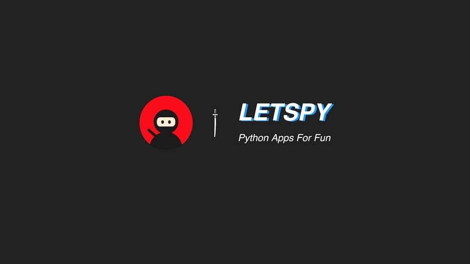

tiny python examples for absolute beginners
-------------------

## General code samples:

@2021/04/11

- [1-sumof-100nums](./1-sumof-100nums.py)
- [2-check-repetition](./2-check-repetition.py)
- [3-get-remove-clear](./3-get-remove-clear.py)
- [4-iterate-remove](./4-iterate-remove.py)
- [5-check-empty](./5-check-empty.py)
- [6-sort](./6-sort.py)
- [7-check-exist](./7-check-exist.py)
- [8-string-replace](./8-string-replace.py)
- [9-list-2-set](./9-list-2-set.py)
- [10-list-reverse](./10-list-reverse.py)
- [11-list-copy](./11-list-copy.py)
- [12-credit-card](./12-credit-card.py)
- [13-reverse-number](./13-reverse-number.py)
- [14-password-gen](./14-password-gen.py)
- [17-check_leap_year.py](./17-check_leap_year.py)
- [18-find-treasure.py](./18-find-treasure.py)
- [21-read-write-csv](./21-read-write-csv.py)
- [31-interview-algorithms](./31-interview-algorithms.py)


## Interesting Python Apps For Teenagers:

To run these applications, install modules by:

```
pip3 install ...
```

- [Stone Scissor Paper](./54-stone-scissor-paper.py)
- [Guess Number](./55-guess-number.py)
- [Searching Treasure](./18-find-treasure.py)
- [Send Email](./15-send-email.py)
- [Todo List](./41-todo-list.py)
- [Music Player](./44-music-player.py)
- [NASA Image Downloader](./50-nasa-image-download.py)
- [City Weather Forecasting](./53-city-weather-forecast.py)
- [Reading Hot News](./59-fetch-news.py)
- [Lyric Downloader](./43-lyric-downloader.py)
- [Tic Tac Toe](./56-tic-tac-toe.py)
- [Drawing Snow Flake](./57-koch-curve.py)
- [Hand Writing Pad](./58-draw-with-pen.py)
- [Space Fight](./66-sprite-bullets-enemies.py)
- [Stock Trending Plot](./60-stock-trending-chart.py)
- [File Uploader](./61-file-uploader.py)
- [Local Gallery](./62-local-gallery.py)
- [Console Chatting](./63-console-chat.py)
- [Chatter Bot](./64-chatter-bot.py)
- [System Performance Inspector](./65-sys-perform-inspect.py)